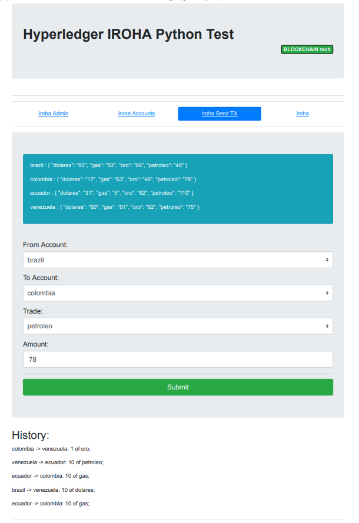

# Python client library example

This projects is based on the work of [Andrey Makhnov](https://github.com/andrcrus/iroha-python-demo)

## Prerequisites

The following are the tools used in the project:

- Hyperledger Iroha (in VM Ubuntu 16.04.6)
- Python 3
- Flask 
- Bootstrap
- vue.js
- axios

Make sure you have running iroha on your machine. 

You can follow [this](https://iroha.readthedocs.io/en/latest/getting_started/index.html) guide to install iroha.

## Launch 

Launch it in your terminal:
```sh
python3 main.py
```

Open the url:

```sh
http://localhost:5000/
```


In the VM you can see the Iroha log:
```sh
sudo docker logs iroha --details -f --tail 0
```


Iroha console
```sh
docker exec -it iroha /bin/bash

root@40a0098150a7:/opt/iroha_data#

                iroha-cli -account_name admin@test

```

#Screenshots

